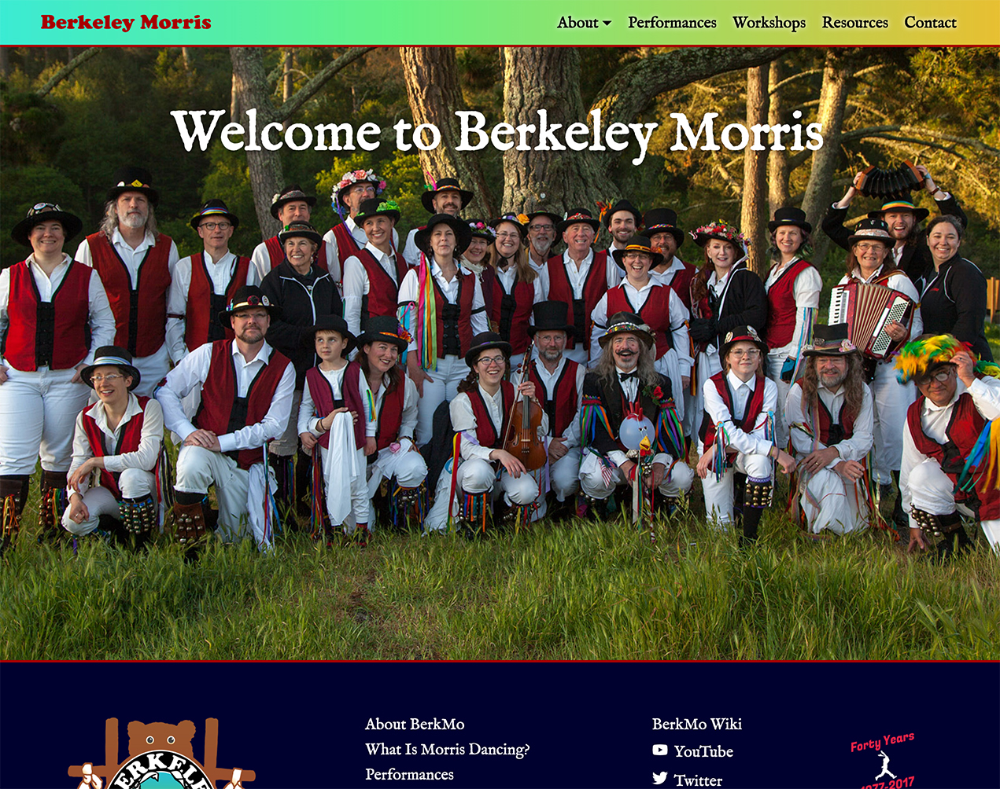

# berkmo-wp-theme
A colorful and responsive Wordpress theme for [Berkeley Morris](https://berkeleymorris.org) reflecting the exotic history of Morris dancing in Berkeley, CA. The theme features lots of rainbow accents, and headers in Igino Marini's [IM FELL](https://iginomarini.com/fell/the-revival-fonts/) typeface.

## Installation
Simply download the folder `berkmo2020`, upload it to your wordpress installation's `wp-content/themes` directory, and then activate it from the "themes" page of your admin dashboard.

## Notes
I started with Tidythemes' excellent [BlankSlate](https://github.com/tidythemes/blankslate) and built all styles from scratch.

This theme is probably not all that useful to you if you aren't using it for Berkeley Morris, but it has some fun things in it that you can borrow. I'm particularly proud of the rainbow drop cap styling.

If you come across any bugs, please let me know!

## License
Not currently providing a license. Please talk to me if you want to use this theme.